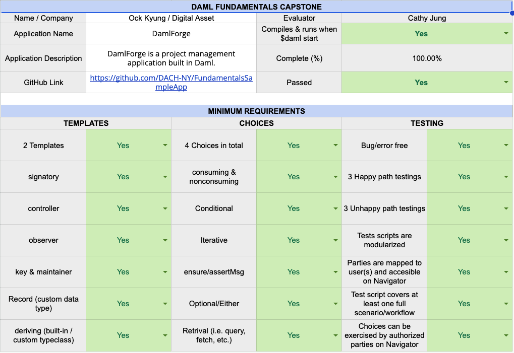

# Disclaimer

**The purpose of this repository is to provide clear instructions and guidelines for Daml learners to pass the Daml Fundamentals certification via their capstone project. Please bear in mind that any code within is provided for illustrative purposes only, and as such may not be production quality and/or may not fit your use-cases. You may use the contents of this repository in parts or in whole according to the BSD0 license:**

> Copyright © 2023 Digital Asset (Switzerland) GmbH and/or its affiliates
>
> Permission to use, copy, modify, and/or distribute this software for any purpose with or without fee is hereby granted.
>
> THE SOFTWARE IS PROVIDED "AS IS" AND THE AUTHOR DISCLAIMS ALL WARRANTIES WITH REGARD TO THIS SOFTWARE INCLUDING ALL IMPLIED WARRANTIES OF MERCHANTABILITY AND FITNESS. IN NO EVENT SHALL THE AUTHOR BE LIABLE FOR ANY SPECIAL, DIRECT, INDIRECT, OR CONSEQUENTIAL DAMAGES OR ANY DAMAGES WHATSOEVER RESULTING FROM LOSS OF USE, DATA OR PROFITS, WHETHER IN AN ACTION OF CONTRACT, NEGLIGENCE OR OTHER TORTIOUS ACTION, ARISING OUT OF OR IN CONNECTION WITH THE USE OR PERFORMANCE OF THIS SOFTWARE.

---

# Daml Fundamentals Certificate Sample App

✨ Welcome to the Daml Fundamentals Certification Sample App! ✨

As part of the certification process, you will be required to complete a backend-only capstone project that demonstrates your understanding of the material covered throughout the Daml Fundamentals Certification Path. You have the freedom to choose the topic of your project as long as it fulfills the criteria specified below. 

**The project must include the following components that are fully operational:**



🚨 **IMPORTANT NOTE** 🚨
+ **If the `daml start` command results in errors or prevents compilation, the capstone project will auto-fail and will not be evaluated.**
+ **The evaluation of your project requires a README that adheres to the format provided in the README of the sample project below.**

+ Your README should document the purpose and functionalities of the project, as well as any important details about how it works. The README file should also include instructions on how to run the project, how to run the tests, and any dependencies required to do so. This documentation will help others understand your project and how to use it, and will also demonstrate your ability to clearly communicate about your work.

To help you prepare for your capstone project, we provide this sample app as a guide for the kind of app you should aim to build. The sample app has been designed to showcase the key concepts and skills that you will need to apply in your own project.

We recommend that you examine this app closely, paying attention to the code structure, functionality, and the test script. We believe that this sample app will be an invaluable resource for you as you work towards your certification. Happy coding!

---

# 🛠️ DamlForge 🛠️ 
DamlForge is a project management application built in Daml.

### I. Overview 
This project was created by using the `empty-skeleton` template. The project adopts and exemplifies the `proposal-accept` design pattern. 

Proposer can create a ProjectProposal contract. Evaluator can exercise ProposerAccomplishments to confirm if the proposer is ready to take on the new project. Evaluator can either Reject or Approve the proposal. Upon getting rejected, proposer can exercise Revise to re-propose the project with updated details. Upon getting approved, a Project contract is created, which then evaluator can Evaluate to create an Accomplishmen contract with, if the Project contract is considered ready to be published.


### II. Workflow
  1. proposer creates a ProjectProposal contract     
  2. evaluator exercises ProposerAccomplishments to check proposer's past accomplishments and confrim if proposer is ready to take on a new responsibility
  3. evaluator exercises Reject with a feedback: "Aim to finish it by the end of March"
  4. proposer exercises Revise with an updated endDate (March 25, 2023)
  5. evaluator exercises Approve - a Project contract is created
  6. evaluator exercises Evaluate and decides that it's ready to be published - an Accomplishment contract is created

### III. Challenge(s)
* `controller ... can` syntax causes warning in Daml 2.0+. The code itself does not cause any issues/errors in 2.5.0 but according to the warning, the syntax will be deprecated in the future versions of Daml. More information [here](https://docs.daml.com/daml/reference/choices.html#daml-ref-controller-can-deprecation).
* The new controller syntax requires a controller to be an observer first before they can exercise a choice, otherwise it'll throw an error: "Attempt to fetch or exercise a contract not visible to the committer." For more information, check out [this post](https://discuss.daml.com/t/error-attempt-to-fetch-or-exercise-a-contract-not-visible-to-the-committer/1304/1) on the Daml Forum.
* The project was created by using `empty-skeleton` and the following was removed from `daml.yaml`:
```
sandbox-options:
   - --wall-clock-time
```
and the following was added:

```
exposed-modules:
  - Main
```
For more info, check out [this post](https://discuss.daml.com/t/sandbox-options-wall-clock-time/5692/16?u=cathy_jung) on Daml Forum and [Daml Doc](https://docs.daml.com/tools/navigator/index.html?&_ga=2.48248804.337210607.1673989679-241632404.1672853064&_gac=1.17025355.1673455980.CjwKCAiA2fmdBhBpEiwA4CcHzfI2w1_D95zAr3_d6QTypOMXGTpUxtS06c55inucNwZvUZn4AebsJxoCZEgQAvD_BwE&_gl=1*elem6v*_ga*MjQxNjMyNDA0LjE2NzI4NTMwNjQ.*_ga_GVK9ZHZSMR*MTY3Mzk5NDQzOS4zMS4xLjE2NzM5OTQ3MDcuMC4wLjA.#logging-in-as-a-party).


### IV. Compiling & Testing
To compile and test, run the pre-written script in the `Test.daml` under /daml OR run:
```
$ daml start
```
